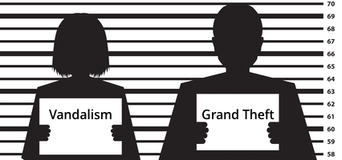
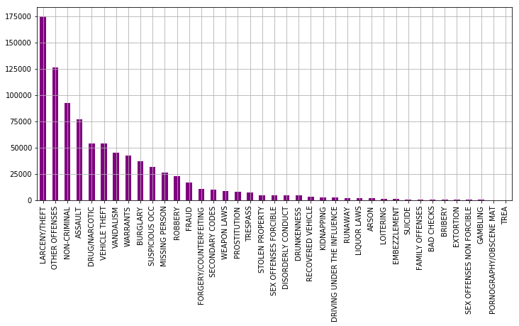

# San Francisco Crime Classification
(from Kaggle Competition)

### 题目描述

在技术天堂盛名之下, 旧金山也是一个罪恶的温床, 在这个项目中, 你将尝试运用机器学习帮助警员判断罪案发生的类型.  
判断罪案类型的意义在于, 能够帮助警局灵活且快速地调配警力以及安排优先级, 防止警力浪费, 加快破案效率.

你会获得2003到2015的罪案记录, 你需要利用坐标, 区域, 日期, 辖区警署等特征建立分类模型, 判断罪案类型.

### 数据下载
此数据集可以从Kaggle上[下载](https://www.kaggle.com/c/sf-crime/data)
或者通过[Kaggle API](https://github.com/Kaggle/kaggle-api)获取  
`$ kaggle competitions download -c sf-crime`

### 建议
* 本项目是一个多分类问题, 类别不均衡

* 你可以对罪案类型的分布进行可视化, 构建一个犯罪地图, 这将是一个很不错的锻炼

_[图片来源](https://www.kaggle.com/benhamner/san-francisco-top-crimes-map/code)_

### 提交
* PDF 报告文件（注意这不应该是notebook的导出，请按照[模板](https://github.com/nd009/capstone/blob/master/capstone_report_template.md)填写）
* 项目相关代码
* 包含使用的库，机器硬件，机器操作系统，训练时间等数据的 README 文档
* 将你的结果提交到[kaggle](https://www.kaggle.com/c/sf-crime/leaderboard), 在报告中汇报你在公榜的分数

### 参考
相关[kaggle kernels](https://www.kaggle.com/c/sf-crime/kernels)
