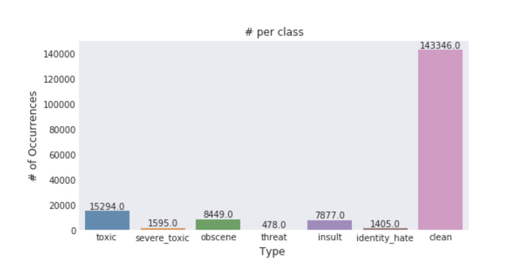
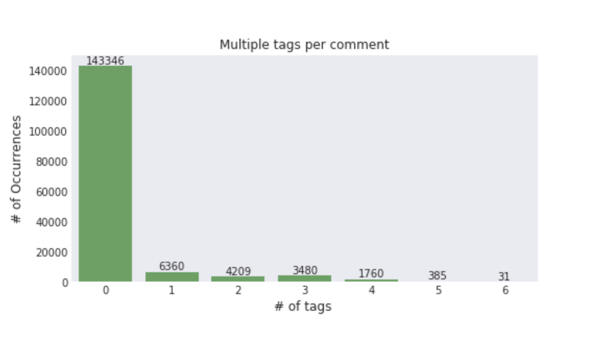

## Jigsaw恶毒评论分类

### 准备工作

优达学城推荐学生安装 [Anaconda](https://www.continuum.io/downloads)，这是一个常用的Python集成编译环境，且已包含了本项目中所需的大部分函数库。我们在P0项目中也有讲解[如何搭建学习环境](https://github.com/nd009/titanic_survival_exploration/blob/master/README.md)。

此题需要进行深度学习模型的建模，推荐使用Keras2.0.8以上版本；

预训练词向量对于此题特别关键，推荐下载GloVe fastText word2vec各自最大的词向量版本，下载地址如下：
* [GloVe](https://nlp.stanford.edu/projects/glove/)
* [fastText](https://fasttext.cc/docs/en/english-vectors.html)
* [word2vec](https://github.com/3Top/word2vec-api#where-to-get-a-pretrained-models)

### 题目描述

Jigsaw(前身为Google ideas）在kaggle平台上举办了一场[文本分类比赛](https://www.kaggle.com/c/jigsaw-toxic-comment-classification-challenge#description)，旨在对于网络社区部分恶毒评论进行区分鉴别。在该赛题中，你需要建立一个可以区分不同类型的言语攻击行为的模型，该赛题一共提供了toxic,severe_toxic,obscene,threat,insult,identity_hate这六种分类标签，你需要根据提供的训练数据进行模型训练学习。

我们这里要求你使用Kaggle端的数据集，其由Train,Test两部分构成，你需要通过在Train数据集上进行验证集划分、建模，在Test数据集上进行测试，并且提交到Kaggle进行测评。

数据集下载链接：https://www.kaggle.com/c/jigsaw-toxic-comment-classification-challenge/data

### 题目特点

1. 非平衡数据集，很显然该题是一个严重不平衡的数据集
   
2. 多类别标签，也就是一个样本可能被归于多于一个的标签，例如对于某评论，其既涉及言语辱骂，也带有威胁性质，就可以标注为toxic,threat
   

### 预备知识

1. 了解词向量模型，例如Word2vec,GloVe,fastText
2. 了解一维卷积神经网络，递归神经网络
3. 传统类模型，例如词袋模型，N-gram，tfidf

   
   
### 建议

在撰写报告的时候，可以侧重于理论知识方面的论述，包括但不限于：
1. 文本的两种基本表征方式（词向量模型，词袋模型）
2. 深度神经网络中不同优化器之间的区别（SGD,Adam,RMSprop等）
3. 深度类模型的综述、TextCNN,LSTM等
4. 基于词袋模型+tfidf+lsvc的传统模型介绍

在进行算法试验的过程中，一定要注意记录你的网络调参过程，该题对于深度类网络的调参是有一定要求的，另外，该题需要搭建GPU环境。

模型融合部分，可以尝试最简单的加权平均方法，也可以直接使用更加复杂的Stacking，相关模型融合资料可以参考[这里](https://mlwave.com/kaggle-ensembling-guide/)

### 要求
* PDF 报告文件（注意这不应该是notebook的导出，请按照[模板](https://github.com/nd009/capstone/blob/master/capstone_report_template.md)填写）
* 项目相关代码

* 包含使用的库，机器硬件，机器操作系统，训练时间等数据的 README 文档

* 这里我们要求你的最优提交分数需要达到kaggle private leaderboard 的top 20%，且对于单模型分数有一定的要求，你需要关注于你的单模型构建，并且在报告你给出你最高的单模型线上得分。

* 此题主要关注于NLP领域深度类模型的构建，关注点是学生对于深度类模型在NLP领域的应用。而另外一个capstone(quora question duplicate）则考察学生对于NLP基本知识的综合应用，涉及范围较该题更加广。

* 考虑到该课题的深度性，学员需要进行**不少于两个**的基于预训练词向量的深度类型模型的建模以及**不少于一个**的传统词袋模型建模。在你的报告中，你需要阐述清晰你所使用的模型和词向量。**不可以直接使用他人的代码**

* 符合Udacity的[项目要求](https://review.udacity.com/#!/rubrics/273/view)。

### 部分解决方案参考

1. [词袋模型 + LR 解决方案](https://www.kaggle.com/tunguz/logistic-regression-with-words-and-char-n-grams)
2. [TextCNN 解决方案](https://www.kaggle.com/yekenot/textcnn-2d-convolution)
3. [LSTM + Attention 解决方案](https://www.kaggle.com/qqgeogor/keras-lstm-attention-glove840b-lb-0-043)
4. [GRU 解决方案](https://www.kaggle.com/prashantkikani/pooled-gru-with-preprocessing)
5. [GRU + CNN 解决方案](https://www.kaggle.com/konohayui/bi-gru-cnn-poolings)

